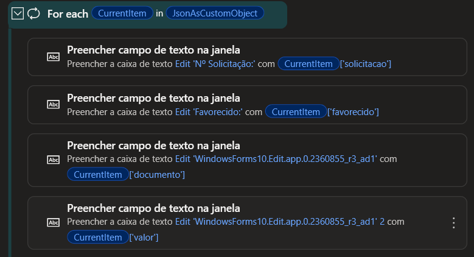
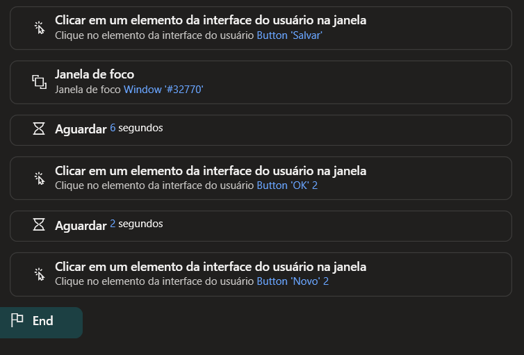

# Power Automate Desktop

O Power Automate Desktop é responsável pela execução da automação no sistema legado.

Neste projeto, ele recebe os dados preparados pelo n8n, interpreta as informações e realiza o preenchimento do sistema desenvolvido em VB.NET.

## 1. Recebimento dos dados e abertura do sistema

O fluxo recebe os dados enviados pelo n8n em formato JSON e os converte para uma estrutura que possa ser utilizada durante a automação.

Em seguida, o PAD abre o sistema legado que receberá os registros.

## 2. Preenchimento automático

Com os dados preparados, o PAD percorre os registros recebidos e preenche os campos do sistema automaticamente.

Cada item do JSON representa uma solicitação, permitindo processar vários registros sem precisar realizar o preenchimento manualmente.

## 3. Gravação e continuidade do fluxo

Após preencher os dados, o PAD aciona o botão Salvar do sistema e aguarda a confirmação da operação.

Na sequência, prepara o formulário para o próximo registro e continua o processamento até finalizar os itens recebidos.

## Fluxo resumido

n8n → JSON → Power Automate Desktop → Sistema legado → SQL Server
