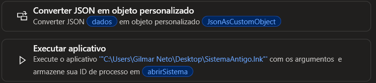

# Power Automate Desktop

Fluxo responsável por receber os dados enviados pelo n8n e automatizar o preenchimento do sistema legado desenvolvido em VB.NET.

## 1. Preparação dos dados e abertura do sistema

O Power Automate Desktop recebe os dados enviados pelo n8n em formato JSON e os converte para uma estrutura que possa ser utilizada durante a automação. Em seguida, o fluxo abre o sistema legado que será alimentado automaticamente.

